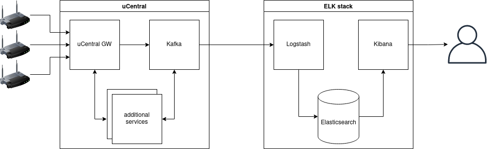
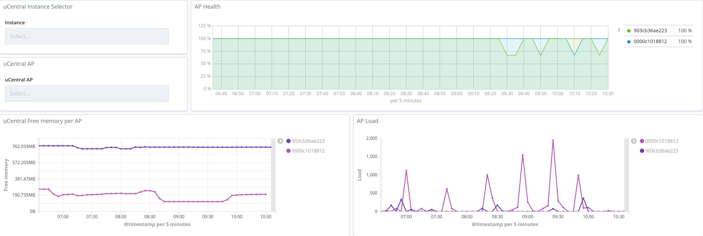
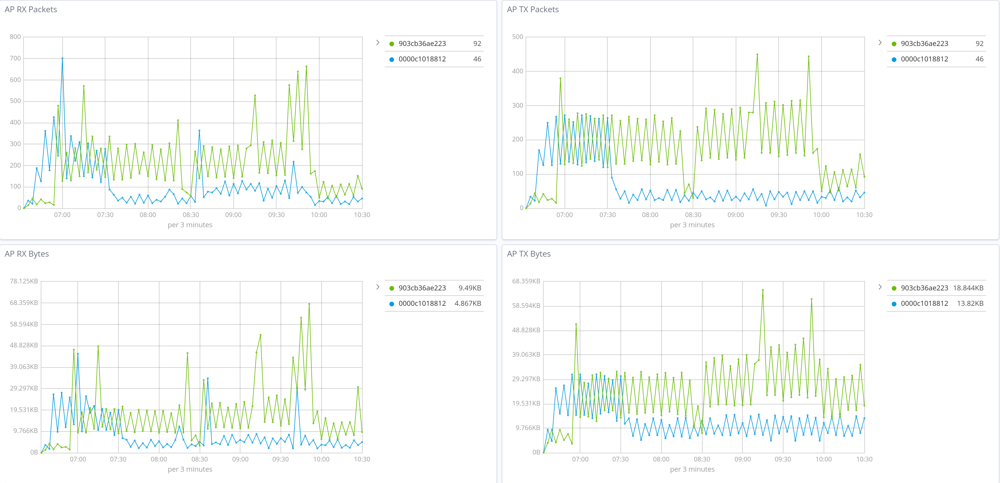

# uCentral analytics

## Collecting metrics with ELK stack



The above image describes the general flow of metric data through a uCentral instance into a standard ELK stack to provide various insights to the user.

The process begins with APs pushing their data to the uCentral gateway at a configurable interval. These metrics are then being sent to the Kafka broker included in every uCentral installation.

Afterwards you are required to set up an ELK stack. ELK stands for the following components:

- Elasticsearch is a document search engine with an HTTP API to query data
- Logstash is responsible for receiving, transforming and then sending data to Elasticsearch
- Kibana provides a user interface for searching and visualizing data stored in Elasticsearch

If that's done, Logstash will get configured to receive data from the Kafka broker, do some minor mutations and push the resulting documents into Elasticsearch.

The appropriate configuration could look like so:

```
# read messages from relevant Kafka topics
input {
  kafka {
    bootstrap_servers => "kafka-headless.ucentral-00.svc.cluster.local:9092"
    topics => ["state", "healthcheck"]
    decorate_events => true
    auto_offset_reset => "latest"
    client_id => "ucentral-00"
    add_field => { "instance" => "ucentral-00" }
  }
}

# add kafka metadata to document
filter {
  mutate { copy => { "[@metadata][kafka]" => "kafka" } }
}

# decode message as JSON
filter {
  json {
    source => "message"
    remove_field => [ "message" ]
  }
}

# convert system load array into separate fields
filter {
  if ([payload][state][unit][load]) {
    mutate {
      add_field => { "[payload][state][unit][load1]" => "%{[payload][state][unit][load][0]}" }
      add_field => { "[payload][state][unit][load5]" => "%{[payload][state][unit][load][1]}" }
      add_field => { "[payload][state][unit][load15]" => "%{[payload][state][unit][load][2]}" }
      remove_field => [ "[payload][state][unit][load]" ]
    }

    mutate {
      convert => {
        "[payload][state][unit][load1]" => "integer"
        "[payload][state][unit][load5]" => "integer"
        "[payload][state][unit][load15]" => "integer"
      }
    }
  }
}

# send message to Elasticsearch
output {
  elasticsearch {
    hosts => "http://elasticsearch-client.monitoring.svc.cluster.local:9200"
    index => "logstash-ucentral-%{+YYYY.MM.dd}"
  }
}
```

Finally we can create visualization in Kibana based on AP metrics like the following:




Exports of these Kibana visualization can be found [here](kibana/dashboard-ucentral-metrics.json).