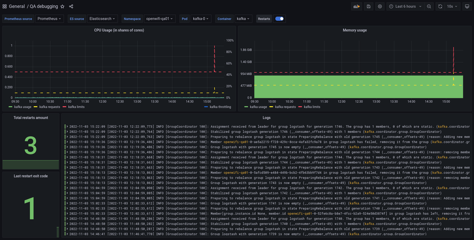

# uCentral analytics

## Collecting metrics with ELK stack


The above image describes the general flow of metric data through a uCentral instance into a standard ELK stack to provide various insights to the user.

The process begins with APs pushing their data to the uCentral gateway at a configurable interval. These metrics are then being sent to the Kafka broker included in every uCentral installation.

Afterwards you are required to set up an ELK stack. ELK stands for the following components:

- Elasticsearch is a document search engine with an HTTP API to query data
- Logstash is responsible for receiving, transforming and then sending data to Elasticsearch
- Kibana provides a user interface for searching and visualizing data stored in Elasticsearch

If that's done, Logstash will get configured to receive data from the Kafka broker, do some minor mutations and push the resulting documents into Elasticsearch.

The appropriate configuration could look like so:

```
# read messages from relevant Kafka topics
input {
  kafka {
    bootstrap_servers => "kafka-headless.ucentral-00.svc.cluster.local:9092"
    topics => ["state", "healthcheck"]
    decorate_events => true
    auto_offset_reset => "latest"
    client_id => "ucentral-00"
    add_field => { "instance" => "ucentral-00" }
  }
}

# add kafka metadata to document
filter {
  mutate { copy => { "[@metadata][kafka]" => "kafka" } }
}

# decode message as JSON
filter {
  json {
    source => "message"
    remove_field => [ "message" ]
  }
}

# convert system load array into separate fields
filter {
  if ([payload][state][unit][load]) {
    mutate {
      add_field => { "[payload][state][unit][load1]" => "%{[payload][state][unit][load][0]}" }
      add_field => { "[payload][state][unit][load5]" => "%{[payload][state][unit][load][1]}" }
      add_field => { "[payload][state][unit][load15]" => "%{[payload][state][unit][load][2]}" }
      remove_field => [ "[payload][state][unit][load]" ]
    }

    mutate {
      convert => {
        "[payload][state][unit][load1]" => "integer"
        "[payload][state][unit][load5]" => "integer"
        "[payload][state][unit][load15]" => "integer"
      }
    }
  }
}

# send message to Elasticsearch
output {
  elasticsearch {
    hosts => "http://elasticsearch-client.monitoring.svc.cluster.local:9200"
    index => "logstash-ucentral-%{+YYYY.MM.dd}"
  }
}
```

Finally we can create visualization in Kibana based on AP metrics like the following:


Exports of these Kibana visualization can be found [here](kibana/dashboard-ucentral-metrics.json).

## Grafana QA debugging dashboard



Repository includes exported Grafana dashboard that's used for debug puproses in TIP-managed testing environments deployed in Kubernetes. Dashboard allows to get all required information regarding container operation, restarts information and runtime logs.

Provided information (from top left to bottom right):

1. CPU usage information (usage, container requests and limits, throttling info);
2. RAM usage information (usage, container requests and limits);
3. Total container restarts count;
4. Last restart exit code;
5. Container logs.

### Deployment requirements

1. ElasticSearch 6 (version 6.8.22 is tested) - used for logs collection;
2. Prometheus (version 2.39.1 is tested) - used for metrics collection (Operator is recommended);
3. kube-state-metrics - used for pod metrics collection (requires forked version from https://github.com/Telecominfraproject/wlan-cloud-kube-state-metrics with enabled pod exit code metric OR if you need Docker image, you may use the latest from https://tip.jfrog.io/ui/repos/tree/General/tip-wlan-cloud-ucentral/kube-state-metrics);
4. Grafana 8 (version 8.5.13 is tested) - used for visualization;

Grafana 8 is used because of ElasticSearch 6 deprecation in version 9.
